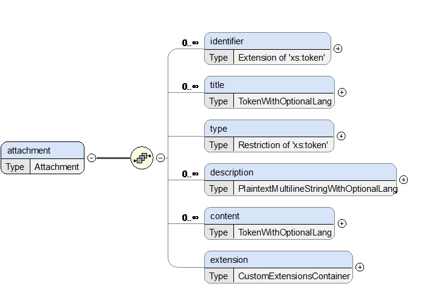

# Technical Description and Implementation Guide

1	INTRODUCTION
--------------
This document is a technical description of EMREX, and describes what has to be implemented locally to connect to the EMREX network. For information on how to join EMREX, please see "How to Join" on the project's main website.  
The term Result owner is used in the document and refer to a person that has results/achievements from education provided by the EMREX network. This is typically a person applying for studies or work, or in any other situation with the need provide verifiable documentation of results from education.  
An active partner in the EMREX network can have one or both of the following two roles:

1. Provide the result owner with application(s) that allow them to fetch their results (e.g. achievement records) from education, either in the same country or from abroad. This will later on be referred to as the EMREX Client.

2. Provide national client(s) with functionality to fetch assessments (results from courses, qualification) from the databases containing this information. This will later on be referred to as the EMREX Data Access Point (EMP).
Because EMREX is a decentralized system, there are no major components that new partners can reuse out of the box. The EMREX project does provides some modules, plugins and examples that can be used and built upon (see Chapter 4.5), however there are a couple of issues that cannot be solved in a general way:

1. Authenticating a result owner. Each country has their own way of authenticating a student in their system. In Norway there are Feide and ID-porten, Finland has Haka, Sweden has Swamid and so on. Therefore, the EMREX project cannot make a complete login module and distribute this, as each country solves this in different ways.

2. Fetching results for a result owner. Each country/institution has their own student information systems. Some countries have national data sources that can provide this information. Therefore, there is not one unified way of fetching results from these systems.  
The EMREX-infrastructure is dependent on connecting to an existing solution that can fetch results for a given result owner at a given institution. The preferred solution is to build a REST service for each student information system involved, that provides ELMO formatted data.

3. Storing results for a result owner. Each country/institution has their own student information systems. So there is no standard way of storing the result data the EMREX fetches into the existing student system. When the EMREX client returns a set of results for a result owner, these must be stored in some local system, as EMREX does not store data in itself.
The following main parts will be referred to through this document:

1. Common components of EMREX (no local work required)
a.	EWP: This is a central registry the EMREX uses to fetch the data that is needed to complete the result transfer. This is also the only centralized component in the EMREX system.

2. EMREX Client: This is the web application that the student uses to initiate the transfer of their results from another country (Some local work required). Typically EMREX clients are systems for Admission, Student Information, Recruitment and so on.

3. EMP: EMREX Data Access Point. This is the point that the EMREX client contacts to fetch results. (Some local work required) Result Services: These are the services that are used by the EMP to fetch the results for the result owner. If you have an existing system that handles this, the EMP can simply connect to it. However, if none exists, there may be a major job to implement this. (Potentially much local work required)

2	USE CASES
-----------
EMREX can be used in a variety of scenarios, like student exchange, cross-studies and internal mobility, job applications, etc. In this chapter, we will briefly illustrate the solution with two examples.

### 2.1	Scenario 1 – Student Coming Back From a Student Exchange
Matti is a Masters student at the University of Helsinki in Finland. As part of his studies, he is sent to an exchange to the University of Oslo in Norway where he takes three courses. After returning back to Helsinki, Matti wants to retrieve his results from Norway and store them into the Finnish student information system (SIS).  

Matti logs into the Finnish SIS using his HAKA credentials and selects the option to import results from a foreign higher education institution using EMREX. After choosing Norway, he is redirected to the Norwegian Emrex Data Access Point (EMP) called Vitnemålsportalen. There, he can login using his university credentials (Feide) or the national ID portal called ID-porten. Vitnemålsportalen has information on all of Matti’s higher education achievements in Norway, in this case from the University of Oslo. Matti is given the option to choose which results he wants to transfer to Finland, and does so. He is then redirected back to the Finnish SIS, where he can confirm his selection of results before importing them. He is also given the option to download a digitally signed, human-readable PDF document which he can freely choose to use for other purposes.

### 2.2	Scenario 2 – Student Continuing Studies in Another Country
Marcin has completed two years of teacher education at the University of Warsaw (UW). He and Ewa have been together as a couple for several years and would like to see more of each other. Since Ewa is studying at the University of Siena (UNISI), Marcin has applied to the same institution with the aim of completing his teacher education there. In the meantime this has become a five-year programme of study. However, since Marcin has already earned 240 credits, and does not want to have to retake courses in Siena, the University needs information about his results from UW.  

Therefore he logs on to the University of Siena’s SIS and selects the option to apply for specific recognition of programmes of study taken elsewhere. There he describes what kind of education he has and what specific recognition he believes he should be given. Since Poland is connected to EMREX, he is then given the option to import results directly. He is redirected to the Polish EMP where he, after logging in with his Polish credentials, chooses which results to transfer to the UNISI. After having been presented with the transferred results at UNISI, and confirming that everything is indeed correct, Marcin imports them into the application.  

In the case of specific recognition of educational programmes taken elsewhere, an institution requires information about the courses which the results achieved by the student at an external institution are based on. The more (relevant) information that the external institution can provide, the easier it is to obtain specific recognition. Specific recognition should result in an overview of the courses or larger components of the programme that can be replaced by the student’s external programmes of study and also which courses the student must take to satisfy the qualification requirements. EMREX facilitates the process of transferring the results themselves in a secure and trustworthy way.

3	ARCHITECTURE
--------------
The following diagram shows in detail the data flow for a student wanting to import results from two different result providers (for instance, higher education institutions) in the same country. The example shows the situation where results are fetched from Norway.


It is up to each implementer to decide whether the SMP will run as a standalone service, or embedded into their client.
The same remark applies to the result provider(s), the implementation is very much dependent on the underlying system(s).

4	GETTING THE RESULTS
---------------------
This chapter is meant for consumers of results from the EMREX network. There are 3 main steps the client needs to perform in order to get results from the network, each of which will be described in detail:

1.	Choosing the EMP
2.	Sending a request to the EMP
3.	Receiving a response
4.	Interpreting and handling the data

### 4.1	Choosing the EMP
In order to initiate the transfer, one must first choose the EMREX Data Access Point to get the results from. This is done by contacting EWP, a centralized service that gives a list of all available EMPs, as well as other information necessary to establish communication with each of them. Administration of EMPs within EWP is out of scope of this document.  

A note to EMP implementers: when building an EMP, the certificate that will be added to EWP and later used to sign and verify the ELMO documents should not be self-signed, as validation of such signatures might fail on some clients. Make sure to obtain a valid certificate issued by a trusted Certificate Authority (CA), and make sure to replace it before it expires.
At the moment, the URL for EWP is as follows:
-	Test: 	https://dev-registry.erasmuswithoutpaper.eu/catalogue-v1.xml  
-	Production: 	https://registry.erasmuswithoutpaper.eu/catalogue-v1.xml  

The response from EWP contains a list in the following XML format:

```xml
<catalogue>
    <host>
        <ewp:admin-email>vp-utviklere@unit.no</ewp:admin-email>
        <apis-implemented>
            <d5:discovery version="5.0.0">
                <d5:url>https://app.vitnemalsportalen.no/vp/ewp/info</d5:url>
            </d5:discovery>
            <emrex-data-access-point
                    xmlns="https://github.com/erasmus-without-paper/ewp-specs-api-emrex-data-access-point/blob/stable-v1/manifest-entry.xsd"
                    version="1.0.0">
                <url>https://app.vitnemalsportalen.no/vp/init</url>
                <name>Norway registry</name>
                <country-code>NO</country-code>
                <certificate>MIIHuDCCBaCgAwIBAgIQfOKwBTMobpwjBBItr0LaEjANBgkqhkiG9w0BAQwFADBE.....</certificate>
            </emrex-data-access-point>
        </apis-implemented>
    </host>
    <host>
        <ewp:admin-email>noreply@usosweb.uw.edu.pl</ewp:admin-email>
        <apis-implemented>
            <d5:discovery version="5.0.0">
                <d5:url>https://usosweb.uw.edu.pl/api/manifest.php</d5:url>
            </d5:discovery>
            < emrex-data-access-point
                    xmlns="https://github.com/erasmus-without-paper/ewp-specs-api-emrex-ncp/blob/stable-v1/manifest-entry.xsd"
                    version="1.0.0">
                <url>https://usosweb.uw.edu.pl/ncp_endpoint.php</url>
                <name>UW</name>
                <country-code>PL</country-code>
                <institution>University of Warsaw</institution>
                <certificate>MIIGZTCCBE2gAwIBAgIUGgekPKlCvZ99TgvhQG4zlYBaa3EwDQYJKoZIhvcNAQEL.....</certificate>
            </emrex-data-access-point>
        </apis-implemented>
    </host>
</catalogue>
```

Note that not all <host>-tags has an EMREX Data Access Point.
How EMPs are grouped by country is up to the implementors to decide. Some countries have one EMP for the entire country, others have one EMP per institution.  

Note: A JSON version of the EMP list exists, however it is being phased out in favor of the EWP catalogue service.

### 4.2	Sending a Request to the EMP
The request is sent from a requester as HTTP POST and has two parameters. Note that the form must be of the default type ("application/x-www-form-urlencoded"), not "multipart/form-data":
 
The hidden parameters are as follows:
1.	sessionId: A generated unique session ID from the requester (up to 32 characters). This session ID is not used by the EMP, but it is returned as part of the reply so that the requester can check that the response comes from the EMP as part of the same session
2.	returnUrl: The URL that the EMP shall use to post the reply
As this service is still under development, additional parameters might be added at a later stage.

### 4.3	Receiving a Response
The response is sent as a HTTP POST back to the EMREX Client with four parameters: 
 
The following return codes are supported (the list is subject to change):
1.	EMP_OK: Everything went well, results have been transferred.
2.	EMP_ERROR: Something went wrong. The error message will be in the "returnMessage"
3.	EMP_NO_RESULTS: There were no results to import into the client.
4.	EMP_CANCEL: The user has cancelled the process.  

At  the time of this documents release we have not fully gotten rid of the old term NCP, as a consequence of this all clients should, in addition to the return codes above, support the following return codes for the time being:
1.	NCP_OK: Everything went well, results have been transferred.
2.	NCP_ERROR: Something went wrong. The error message will be in the "returnMessage"
3.	NCP_NO_RESULTS: There were no results to import into the client.
4.	NCP_CANCEL: The user has cancelled the process.

The "sessionId" must be the same as the one sent in the request. If it is not the same as the one that was sent, this response should not be processed, and the user should be presented with an error message.  
The "elmo" parameter is the main piece of this response. It will be compressed using the gzip algorithm and encoded in Base64 for transfer. Consequently, the receiver must first decode it using Base64 and then uncompress using gzip.

### 4.4	Interpreting and Handling the Data
The ELMO XML format, explained in detail in chapter 5, contains the results themselves. The document is signed, using the XML DSig format, with the private key of the EMP that issued it. The public key can be obtained from the EWP, as shown in chapter 4.1. If signature verification fails, it means the results have been tampered with and MUST be rejected.  

In addition to verifying the signature, the receiving client must ensure the results belong to the same person requesting them. ELMO includes, among other information, the person’s name and birthday (see 5.2) which can be used for this purpose.

### 4.5	Code Examples
The EMREX code is open source and can be downloaded from the EMREX GitHub account.
The following repositories are provided:
-	elmo-schemas: XSD for the ELMO XML format, including an example XML file.
-	emrex-client: An example client that can be used to fetch results (outdated).
-	EMP-mockup: An example EMP (outdated).

5	THE ELMO XML FORMAT
---------------------
The ELMO XML format is the basis for the exchange of result information. ELMO is based on the CEN standard EN 15981-2011 EuroLMAI. EuroLMAI is a data model describing assessments, primarily Diplomas, Diploma Supplements and Transcripts of Records for higher educations. The schema describing the profile of the ELMO format used in EMREX is available in the EMREX GitHub repository. The ELMO format is work in progress, so make sure you always use the newest version.

### 5.1 ELMO
The elmo component is the base of the ELMO-document. It describes the main characteristics of the document. It allows for attachments and an XML-DSIG signature.  

Each element will be discussed in depth in later chapters, except "generatedDate". This is the date for the document in ISO 8601 format and must contain the time zone suffix. Example values: "2015-08-01T12:00:00+02:00" (UTC+2), "2015-08-01T10:00:00Z" (UTC).  

A number of elements allow for extensions. An extension is a generic element where it is possible to put any type of data. Typically, it is used for transfers with ELMO done internally, and other clients will ignore such data. Implementers should make sure to name the extensions uniquely (using the type attribute) to avoid possible collisions with other EMPs’ extensions.


### 5.2 Learner
The learner component covers the information about the student. There is only one learner per ELMO document.


-	citizenship: The ISO 3166-1-alpha-2 code of the country the student is a citizen of.  E.g. "NO"
-	identifier: Person identifiers. There can be several identifiers per person, e.g. national identifier, passport number
-	givenNames: The given names of the student (first, middle)
-	familyName: The family name of the student (last name)
-	bday: Birth date of the student in ISO 8601 format
-	placeOfBirth: The student's place of birth
-	birthName: First name(s) and family name(s) of the student at birth, described as a single text value
-	currentAddress: The student's current physical address.  This is the address which should work when, for example, the user pastes it (without the student’s name) into Google Maps.
-	gender: ISO/IEC 5218 code of human gender
 
### 5.3 Report
The report component describes a report from a single issuer (institution). There can be several reports per ELMO document, as the student can have studied at several institutions. Just as you can have attachments to the elmo component, the report component also allows for attachments.  

Each element will be discussed in depth in later chapters, except for "issueDate". This is the date for the report.


### 5.4 Issuer
The issuer component describes a single issuer (institution) of a set of results. There is one issuer per report. If the student has studied at several institutions, there must be several reports, each with its own issuer.


-	country: An ISO 3166-1-alpha-2 code of the country in which the institution is operating.
-	identifier: Identifier for the institution. There can be several identifiers, e.g. local, SCHAC, Erasmus.
-	title: The name of the institution. There can be several titles in different languages. The language code is given in ISO 3166-1-alpha-2 code.
-	url: The URL for the institution's web page.

### 5.5 Learning-Opportunity Specification (LOS)
The LOS component describes a single learning outcome, be it a passed course, a degree or some other type of module that should be considered as part of the student's competence. The LOS is hierarchical through the "hasPart" element, meaning that one LOS can contain several LOS, like a degree can consist of many courses.


 
-	identifier: The identifier of the LOS. There can be several identifiers, e.g. erasmus, local. Please note that the local identifier is typically the code that identifies the LOS in the local system, for instance the course code. There is also provided an elmo identifier, that is an auto generated string that is used when displaying the results on the web.
-	title: The title of the LOS, for instance course name. There can be several titles in different languages. The language code is given in ISO 3166-1-alpha-2 code.
-	type: The type of the LOS. Accepted types are:
    1. 	Degree Programme
    2. 	Module
    3.	Course
-	subjectArea: The Erasmus subject area code for the LOS.
-	iscedCode: The Erasmus ISCED code for the LOS.
-	url: An URL to a web site with more detailed information.
-	description: A description of the LOS. Can be several descriptions with different languages. The language code is given in ISO 3166-1-alpha-2 code.
-	specifies: Specifies a concrete instance of the LOS. This concrete instance is called a learningOpportunityInstance (explained in chapter 5.6).
-	hasPart: A list of LOSs that is contained within this LOS. For instance: A degree can contain several courses.

### 5.6 Learning Opportunty Instance (LOI)
The LOI is a person specific instance of an LOS. While the LOS is the description of a course or a grade, the LOI is specific to the student, containing dates, results and credits.  


-	identifier: A list of identifiers of this Learning Opportunity Instance.
-	start: The date the LOI started in ISO 8601 format.
-	date: The date the LOI was finished / achieved in ISO 8601 format.
-	academicTerm: See chapter 5.7.
-	status: The status of this LOI (“passed”, “failed”, “in-progress”)
-	gradingSchemeLocalId: Identifier of the grading scheme used in resultLabel and
resultDistribution below.
-	resultLabel: The achieved result.
-	shortenedGrading: See chapter 5.8.
-	resultDistribution: See chapter 5.9.
-	credit: See chapter 5.10.
-	level: This describes various levels of education.
-	type: EQF
    1. description: An optional detailed description
    2. value: The level value.
-	languageOfInstruction: The language the course/degree was taught.
-	engagementHours: Number of hours spent on the course/degree.
-	attachments: Attachments connected to this specific LOI.
-	grouping: See chapter 0
-	diplomaSupplement: See chapter 0.

### 5.7 Academic Term
The academicTerm component describes the term that the LOI was taught in.


-	title: The title of the term. Can be in several languages. The language code is given in ISO 3166-1-alpha-2 code.
-	start: The date the academic term started in ISO 8601 format.
-	end: The date the academic term ended in ISO 8601 format.
 
### 5.8 Shortened Grading
The shortenedGrading component describes the grading table for the specific student.


-	percentageLower: The percentage of students of the same course who got a lower grade than our learner.
-	percentageEqual: The percentage of students who got the same grade as our learner.
-	percentageHigher: The percentage of students of the same course who got a higher grade than our learner.

### 5.9 Result Distribution
The resultDistribution describes the distribution of grades for that course in that year.


-	category: Describes a grade category.
    1. label: The name of the grade.
    2. count: The number of students who achieved this grade.
-	description: A description of the result distribution in several language. The language code is given in ISO 3166-1-alpha-2 code.
 
### 5.10 Credit
The credit component describes the credits achieved by the student upon achieving the course/degree.


-	scheme: The type of scheme used to calculate the credits (example: ECTS)
-	level: The level the credits were achieved, typically the levels are
    1. Bachelor
    2. Master
    3. PhD
-	value: The number of credits.
 
### 5.11 Attachment
The attachment component describes an attachment in the report. Attachments are usually coded in Base64.



-	identifier: This identifier has been primarily established to enable internal references to attachment from LOIs.
-	title: The title of the attachment. There can be several titles in different languages. The language code is given in ISO 3166-1-alpha-2 code.
-	type: The type of document. Following types are currently accepted:
    1. Diploma Supplement: Supplement to the diploma describing the content of the Diploma. Explanations of grading tables, semesters and so on.
    2. Transcript of Records: The document containing grades.
    3. EMREX Transcript: This is similar to a Transcript of Records, with one big difference. The "EMREX Transcript" is meant to include all the records within the transferred ELMO file (which can span over *multiple* institutions), that is, it should be located *outside* the report elements. In comparison, "Transcript of Records" is meant to be issued (and possibly signed) by a single institution, and should be located inside the report element.
    4. Letter of Nomination: A letter that is used when a student wants to study abroad, the HEI writes a letter to the foreign institution to nominate the student.
    5. Certificate of Training: A certificate confirming that the students have achieved a certain training goal.
    6. Learning Agreement: An agreement between an exchange student, host institution and home institution which includes all the learning outcomes the student is expected to acquire during the exchange.
-	description: A description of the attachment in different languages. The language code is given in ISO 3166-1-alpha-2 code.
-	content: The content of the attachment encoded using a data URI scheme. E.g. "data:application/pdf;base64,iiNhz6QfDnnDybjHLBF2...".
 
### 5.12 Groups
Groups are a way of organizing and sorting over groups of LOIs. 


Grouping can be explained best by showing an example:
-	Group Type 1: By category
    1. Group 1: Mandatory subjects
    2. Group 2: Optional subjects
-	Group Type 2: By subject level
    1. Group 1: Master courses
    2. Group 2: Bachelor courses

When placing a LOI into a group, every group can be referenced by its group type ID and group ID.
 
### 5.13 Diploma Supplement (DS)
Each LOI of type Degree Programme can include a Diploma Supplement (DS). The DS is a document accompanying a higher education diploma, providing a standardised description of the nature, level, context, content and status of the studies completed by its holder. There can be several DSs in different languages. The language code is given in ISO 3166-1-alpha-2 code.


-	version: The version number refers to the official rules for what a DS should include.  As these rules rarely change, it was agreed the version to be the year the rules this document adheres to were introduced (1997, 2007, 2018). The default is 2018.
-	issueDate: The date when the DS was generated. Example values: “2015-08-01”, “2017-01-31”.
-	introduction: The standard introduction which in English starts with "This Diploma Supplement model was developed by the European Commission (...)".
-	section: The section element in the DS refers to the official section numbers (1, 2...), and can include other sections (1.1, 1.2, 2.1, 2.2...). The section number is passed as an attribute (example: number="2.1").
    1. title: The section title SHOULD match the official rules for DS.
    2. content: The content of the section.  The element is optional in cases where a section only has subsections (like top level sections might have). The content type can be defined (example: type="text/plain").
    3. additionalInformation: Any additional information, including possible references to other sections.
    4. attachment: See chapter 5.11.
    5. section: Sub-section (optional).
-	Signature: The DS itself can be digitally signed [4], e.g. if the DS issuer is not the same entity as the one issuing the ELMO document.

6	ELMO EXAMPLE
--------------
```xml
<?xml version="1.0" encoding="UTF-8" standalone="yes"?>
<elmo>
	<generatedDate>2016-07-08T12:26:27+02:00</generatedDate>
	<learner>
		<citizenship>NO</citizenship>
		<identifier type="nationalIdentifier">12345678909</identifier>
		<givenNames>Test</givenNames>
		<familyName>Testing</familyName>
		<bday>1979-03-21</bday>
	</learner>
	<report>
		<issuer>
			<country>NO</country>
			<identifier type="local">194</identifier>
			<identifier type="erasmus">N TRONDHE01</identifier>
			<identifier type="schac">ntnu.no</identifier>
			<title xml:lang="no">Norges teknisk-naturvitenskapelige universitet</title>
			<title xml:lang="en">Norwegian University of Science and Technology</title>
			<url>http://www.ntnu.no/</url>
		</issuer>
		<learningOpportunitySpecification>
			<identifier type="local">M.TEK</identifier>
			<identifier type="nus">759914</identifier>
			<title xml:lang="no">Master i teknologi / Sivilingeniør</title>
			<type>Degree Programme</type>
			<iscedCode>0533</iscedCode>
			<url>http://www.ntnu.no/studier/mttk</url>
			<specifies>
				<learningOpportunityInstance>
					<start>2015-01-15</start>
					<date>2015-06-08</date>
					<academicTerm>
						<title xml:lang="no">2015 Vår</title>
						<title xml:lang="en">2015 Spring</title>
						<start>2015-01-15</start>
						<end>2015-06-08</end>
					</academicTerm>
					<credit>
						<scheme>ECTS</scheme>
						<level>Master</level>
						<value>300</value>
					</credit>
					<diplomaSupplement>
						<issueDate>2015-06-08</issueDate>
						<introduction>This Diploma Supplement model was developed by the European (...)</introduction>
						<section number="2">
							<title>Information identifying the qualification</title>
							<section number="2.3">
								<title>Name and status of awarding institution (in original language)</title>
								<content>Master i biologi</content>
								<additionalInformation>Master is a protected title in Norway</additionalInformation>
							</section>
						</section>
					</diplomaSupplement>
					<extension>
						<element type="fsLevel">590</element>
					</extension>
				</learningOpportunityInstance>
			</specifies>
			<hasPart>
				<learningOpportunitySpecification>
					<identifier type="local">EXPH0001-1</identifier>
					<identifier type="nus">613999</identifier>
					<title xml:lang="no">Filosofi og vitenskapsteori</title>
					<title xml:lang="en">Philosophy and Theory of Science</title>
					<type>Course</type>
					<iscedCode>0229</iscedCode>
					<specifies>
						<learningOpportunityInstance>
							<start>2010-08-15</start>
							<date>2010-12-15</date>
							<academicTerm>
								<title xml:lang="no">2010 Høst</title>
								<title xml:lang="en">2010 Autumn</title>
								<start>2010-08-15</start>
								<end>2010-12-15</end>
							</academicTerm>
							<resultLabel>D</resultLabel>
							<resultDistribution>
								<category count="1101" label="A"/>
								<category count="2592" label="B"/>
								<category count="4284" label="C"/>
								<category count="3110" label="D"/>
								<category count="2256" label="E"/>
							</resultDistribution>
							<credit>
								<scheme>ECTS</scheme>
								<level>Bachelor</level>
								<value>7.5</value>
							</credit>
							<engagementHours>0.0</engagementHours>
							<extension>
								<element type="fsLevel">70</element>
								<element type="fsGradingScheme">NO30</element>
							</extension>
						</learningOpportunityInstance>
					</specifies>
				</learningOpportunitySpecification>
			</hasPart>
			<hasPart>
				<learningOpportunitySpecification>
					<identifier type="local">SPRÅK3501-1</identifier>
					<identifier type="nus">713999</identifier>
					<title xml:lang="no">Vit. kommunikasjon for ingeniører</title>
					<title xml:lang="en">Scientific Communication for Engineers</title>
					<type>Course</type>
					<iscedCode>0229</iscedCode>
					<specifies>
						<learningOpportunityInstance>
							<start>2014-08-15</start>
							<date>2014-12-15</date>
							<academicTerm>
								<title xml:lang="no">2014 Høst</title>
								<title xml:lang="en">2014 Autumn</title>
								<start>2014-08-15</start>
								<end>2014-12-15</end>
							</academicTerm>
							<resultLabel>Bestått</resultLabel>
							<credit>
								<scheme>ECTS</scheme>
								<level>Master</level>
								<value>7.5</value>
							</credit>
							<engagementHours>0.0</engagementHours>
							<extension>
								<element type="fsLevel">500</element>
								<element type="fsGradingScheme">NO04</element>
							</extension>
						</learningOpportunityInstance>
					</specifies>
				</learningOpportunitySpecification>
			</hasPart>
		</learningOpportunitySpecification>
		<issueDate>2016-07-08T12:26:27+02:00</issueDate>
	</report>
</elmo>
```
